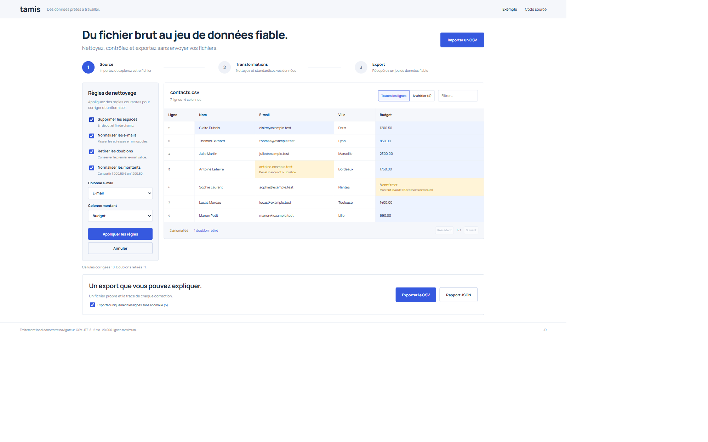
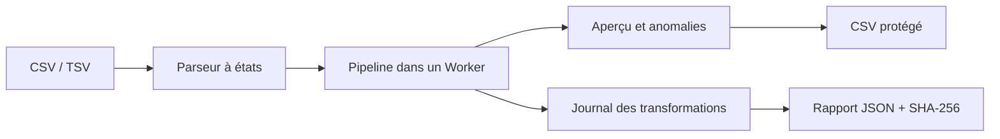

# Tamis

### Du fichier brut au jeu de données fiable.

Un atelier CSV pour préparer une migration CRM, nettoyer un export de contacts ou contrôler un fichier avant import. Les données restent dans le navigateur.

[**Ouvrir l’atelier**](https://imtoocompedidiv.github.io/tamis/) · [Architecture](#architecture) · [Vérifications](#vérifications)



## Essayer en une minute

1. Ouvrir l’exemple de huit contacts.
2. Appliquer les règles : les espaces et les montants sont normalisés, les adresses passent en minuscules, un doublon est retiré.
3. Inspecter les deux anomalies restantes. Survoler une cellule bleue pour voir sa valeur précédente.
4. Exporter les cinq enregistrements valides et le rapport JSON, ou annuler la transformation.

Importez aussi votre propre CSV ou TSV UTF-8. Les colonnes e-mail et montant sont configurables. Aucune création de compte, aucune clé et aucun transfert de fichier à un serveur.

## Ce qui est implémenté

- Parseur à états : séparateur détecté hors guillemets, BOM, CRLF, champs multilignes, guillemets doublés ; refus explicite des entrées ambiguës.
- Pipeline pur et non destructif : normalisation, validation, déduplication par e-mail valide, suivi des valeurs avant/après et des enregistrements retirés.
- Exécution des transformations dans un Web Worker, avec identifiant de requête pour ignorer les réponses devenues obsolètes.
- Aperçu filtrable et paginé ; historique de dix transformations ; export des lignes valides ou de toutes les lignes.
- Export CSV avec protection contre les formules de tableur. Rapport JSON lié au fichier source par SHA-256.
- Interface clavier et mobile, polices servies localement, sans analyse d’audience.

## Architecture



| Fichier                | Responsabilité                        |
| ---------------------- | ------------------------------------- |
| `src/core/csv.ts`      | Lecture stricte et sérialisation      |
| `src/core/pipeline.ts` | Règles, validation et journal         |
| `src/worker.ts`        | Traitement hors du fil de l’interface |
| `src/DataTable.tsx`    | Aperçu, filtres et pagination         |
| `src/App.tsx`          | Import, historique et exports         |

## Développer

Node.js 22.12 ou supérieur compatible Vite 8.

```sh
npm ci
npm run dev
npm run check
npm run build
```

## Vérifications

21 tests couvrent notamment les champs multilignes, les données mal formées, la neutralisation des formules, les règles de déduplication, la conservation de la source et la normalisation décimale. La CI vérifie aussi TypeScript, le formatage et le build avant le déploiement Pages.

## Périmètre

2 Mo, 20 000 enregistrements et 60 colonnes maximum. Les numéros du rapport désignent les enregistrements CSV, en-tête compris, et non les lignes physiques d’un champ multiligne. Le contrôle d’e-mail est syntaxique ; il ne vérifie pas l’existence d’une adresse. Les montants acceptent au plus deux décimales et n’interprètent pas automatiquement toutes les conventions internationales. L’export préfixe les valeurs pouvant être interprétées comme des formules, y compris les nombres négatifs, d’une apostrophe. Les fichiers ne sont pas conservés après rechargement.

## Crédits

Projet de JD. React, Vite, TypeScript et Vitest ; Manrope et IBM Plex Mono distribuées via Fontsource. Les exemples sont fictifs. Licence MIT pour le code du projet ; les dépendances conservent leurs licences.
